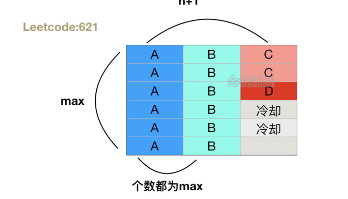

这题是621升级版，我们也用一行行的方法去做，但是不冷却了，如果遇到冷却直接结束，k就是621里的n+1
关键在于PriorityQueue存Map.Entry即存hashmap里的一对对，每次都把最大的拿出来放进去结果里面

思路就是用maxHeap存着，每次拿最大的，把最大的拿出来以后value减去1再放到queue里，等第一行排完再拿出来，
然后一个个排
然后如果这行遇到了冷却，这时候maxHeap是空的，直接就结束了，也是为什么最后需要判断长度是否小于给定的长度

关键就在于queue，第一行排完以后就开始一个个添加，每一次都尽量（除非答案返回空）走下面的if
然后把上一行（第一行）第一个比如说a放在queue后面，保证了如果还有a且上一行是a在第一个，
下一行a就在第一个，当然也不一定，但这种情况是刚刚好，最坏的情况，其他的比这个简单多了自动就搞好了
aaadbbcc k=2，这个基本上怎样都行，我们考虑最坏是第一行刚好放完全部

class Solution {

    public String rearrangeString(String s, int k) {
        //corner case
        if(k<=1) return s; 
        HashMap<Character,Integer> map=new HashMap<>();
        PriorityQueue<Map.Entry<Character,Integer>> maxHeap=new PriorityQueue<>((a,b)->{
            return b.getValue()-a.getValue();
        });
        for(char c : s.toCharArray()){
            map.put(c,map.getOrDefault(c,0)+1);
        }
        maxHeap.addAll(map.entrySet());
        StringBuilder sb=new StringBuilder();
        //存储丢掉的
        Queue<Map.Entry<Character,Integer>> queue=new LinkedList<>();
        while(!maxHeap.isEmpty()){
            //把最大的拿出来
            Map.Entry<Character,Integer> cur=maxHeap.poll();
            sb.append(cur.getKey());
            cur.setValue(cur.getValue()-1);
            //这里是精妙的地方，先放先取，这样保证了
            //下一行的第一个不会是上一行的最后一个
            //例子 aabbcc
            
            queue.offer(cur);
            if(queue.size()==k){
                Map.Entry<Character,Integer> entry=queue.poll();
                if(entry.getValue()>0){
                    maxHeap.add(entry);
                }
            }
        }
        //如果有一行填不满，就直接返回了，因为当时Heap是空的
        return sb.length() <s.length() ? "" : sb.toString();
        
        
    }
}

